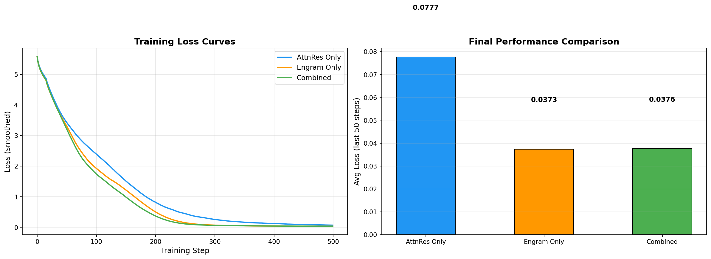

# Engram + Attention Residuals: Implementation & Benchmark

A PyTorch implementation of two recent Transformer architecture innovations and their combination:

- **Engram** (DeepSeek, Jan 2026) — O(1) hash-based memory lookup as a new sparsity axis
- **Attention Residuals** (Kimi / Moonshot AI, Mar 2026) — Learned attention over depth replacing fixed residual connections

> **TL;DR:** Engram injects factual knowledge via deterministic hash tables. Attention Residuals let every layer selectively attend to any prior layer's output. Combined, knowledge injected by Engram remains accessible across the entire network depth without dilution.

---

## Papers

| Paper | Team | arXiv | Key Idea |
|-------|------|-------|----------|
| *Conditional Memory via Scalable Lookup* | DeepSeek | [2601.07372](https://arxiv.org/abs/2601.07372) | O(1) n-gram hash lookup as conditional memory alongside MoE |
| *Attention Residuals* | Kimi / Moonshot AI | [2603.15031](https://arxiv.org/abs/2603.15031) | Replace fixed residual connections with softmax attention over depth |

---

## Architecture Overview

### Engram (DeepSeek)

Engram introduces **conditional memory** as a second sparsity axis alongside MoE's conditional computation. Instead of routing tokens through expensive expert subnetworks for simple factual recall, Engram uses **deterministic hash-based embedding lookup** in O(1) time.

**How it works:**

```
Input tokens → Tokenizer Compression (NFKC, lowercasing → 23% vocab reduction)
            → N-gram Hash (multiplicative-XOR, bigrams + trigrams, 8 heads each)
            → Embedding Table Lookup (per-head prime-sized tables)
            → Context-Aware Gating (sigmoid of query·key similarity)
            → Depthwise Convolution (kernel=4, dilation=3, + residual)
            → Add to hidden states
```

**Key design choices:**
- Placed at specific layers only (layers 2 and 15 in the paper)
- ~20-25% of sparse parameter budget allocated to Engram, rest to MoE
- Embedding tables are offloadable to system DRAM (~2-3% latency overhead)
- Separate optimizer: Adam with 5x LR multiplier, no weight decay for embeddings

**Paper results (Engram-27B vs MoE-27B, iso-param iso-FLOPs):**

| Benchmark | MoE-27B | Engram-27B | Delta |
|-----------|---------|------------|-------|
| MMLU | 57.4 | 60.4 | +3.0 |
| BBH | 50.9 | 55.9 | +5.0 |
| NIAH (Multi-Query) | 84.2 | 97.0 | **+12.8** |
| Variable Tracking | 77.0 | 89.0 | **+12.0** |
| GSM8K | 58.4 | 60.6 | +2.2 |

### Attention Residuals (Kimi)

Standard residual connections accumulate layer outputs with fixed unit weights: `h_l = h_{l-1} + f(h_{l-1})`. This means every layer receives the same uniformly-weighted sum of all prior outputs — no selective access, irreversible information loss, and O(L) magnitude growth.

**Attention Residuals** replace this with learned softmax attention over depth:

```
h_l = Σ α_{i→l} · v_i     where α = softmax(q_l^T · RMSNorm(K))
```

**Block AttnRes** (practical variant) groups layers into blocks for efficiency:
- **Intra-block:** Standard residual accumulation
- **Inter-block:** Attention over block summaries + current partial sum
- Each layer applies AttnRes **twice**: before attention and before MLP
- Per-layer overhead: just one learned query vector `w_l ∈ R^d` (initialized to zero)

**Paper results (48B total / 3B active MoE, 1.4T tokens):**

| Benchmark | Baseline | AttnRes | Delta |
|-----------|----------|---------|-------|
| MMLU | 73.5 | 74.6 | +1.1 |
| GPQA-Diamond | 36.9 | 44.4 | **+7.5** |
| BBH | 76.3 | 78.0 | +1.7 |
| Math | 53.5 | 57.1 | +3.6 |
| HumanEval | 59.1 | 62.2 | +3.1 |

**Scaling law:** Block AttnRes matches baseline trained with **1.25x more compute**.

### Why Combine Them?

| Dimension | Engram | AttnRes |
|-----------|--------|---------|
| **What it improves** | Information *injection* (new knowledge) | Information *routing* (how layers compose) |
| **Mechanism** | O(1) hash-based memory lookup | Learned attention over depth |
| **Where it acts** | Specific layers (2, 15) | Every layer boundary |
| **Parameter overhead** | Large tables (offloadable to DRAM) | Negligible (~1 vector per layer) |
| **Strongest gains** | Factual recall, named entities | Reasoning, deep composition |

**Synergy:** Engram injects rich factual embeddings at designated layers. Without AttnRes, these get diluted by fixed-weight residual accumulation. With AttnRes, any downstream layer can selectively **upweight** or **downweight** Engram-enriched representations based on what the current task needs — reasoning layers can skip them, factual-grounding layers can amplify them.

---

## Benchmark Results

All three architectures trained on a character-level language modeling task (500 steps, batch=32, seq_len=128, CPU):

### Results Table

| Model | Params | Init Loss | Final Loss | Min Loss | Avg Last 50 | Time | Steps/s |
|-------|--------|-----------|------------|----------|-------------|------|---------|
| AttnRes Only | 1,040,256 | 5.5835 | 0.0646 | 0.0646 | **0.0777** | 224s | 2.2 |
| Engram Only | 1,620,226 | 5.5668 | 0.0362 | 0.0310 | **0.0373** | 110s | 4.5 |
| Combined (Engram + AttnRes) | 1,623,554 | 5.5780 | 0.0365 | 0.0338 | **0.0376** | 255s | 2.0 |

### Training Loss Curves & Final Comparison



### Test Results

| Suite | Tests | Status |
|-------|-------|--------|
| Engram | 13/13 | All Pass |
| Attention Residuals | 13/13 | All Pass |
| Combined | 6/6 | All Pass |
| **Total** | **32/32** | **All Pass** |

### Observations

1. **Engram dominates on memorization** — its hash lookup memorizes repeated character patterns extremely well, reaching 0.037 avg loss vs AttnRes's 0.078
2. **Combined matches Engram-only** on this small repetitive dataset — AttnRes's depth-routing adds minimal benefit when the task is pure memorization
3. **AttnRes shines at scale** — its strength (selective depth mixing for complex reasoning) is demonstrated in the paper at billions of parameters (+7.5 on GPQA-Diamond)
4. **Speed trade-off** — Engram-only is fastest (no AttnRes overhead); Combined is slowest but gains from both techniques

---

## Project Structure

```
engram_residual_attention/
├── README.md                          # This file
└── codes/
    ├── engram.py                      # Engram module (DeepSeek)
    ├── attention_residuals.py         # Block AttnRes module (Kimi)
    ├── combined_model.py              # Combined architecture
    ├── test_engram.py                 # Engram test suite (13 tests)
    ├── test_attention_residuals.py    # AttnRes test suite (13 tests)
    ├── test_combined.py               # Combined test suite (6 tests)
    ├── benchmark.py                   # Training benchmark + chart generation
    ├── benchmark_chart.png            # Generated comparison chart
    ├── benchmark_losses.json          # Raw loss data from benchmark
    ├── train_notebook.ipynb           # Jupyter notebook for laptop training
    └── overview.md                    # Detailed technical overview of both papers
```

---

## Code Guide

### Core Modules

#### `engram.py` — Engram Implementation

| Class | Description |
|-------|-------------|
| `TokenizerCompressor` | Maps raw token IDs to compressed canonical IDs (simulates NFKC + lowercasing) |
| `NgramHashMapping` | Multiplicative-XOR hash for n-gram → table index mapping |
| `MultiHeadEmbedding` | Multiple embedding tables per n-gram order (collision mitigation) |
| `ShortConv` | Depthwise 1D convolution with SiLU activation and residual connection |
| `EngramModule` | Complete module: retrieval (hash lookup) + fusion (gating + conv) |
| `RMSNorm` | Root Mean Square Layer Normalization |

**Usage:**
```python
from engram import EngramModule

engram = EngramModule(
    vocab_size=32000,
    compressed_vocab_size=25000,
    hidden_dim=512,
    engram_dim=64,          # embedding dim per hash head
    ngram_range=(2, 3),     # bigrams + trigrams
    num_heads=8,            # hash heads per n-gram order
    table_size_hint=10007,  # base prime for table sizes
)

# token_ids: [batch, seq_len] raw token IDs
# hidden:    [batch, seq_len, hidden_dim] current hidden states
output = engram(hidden, token_ids)  # [batch, seq_len, hidden_dim]
# Add output residually to hidden states
```

#### `attention_residuals.py` — Block Attention Residuals

| Class | Description |
|-------|-------------|
| `BlockAttnRes` | Core depth-attention module: softmax over block representations |
| `AttnResTransformerLayer` | Single transformer layer with two AttnRes ops (before attn + before MLP) |
| `AttnResTransformer` | Full transformer with Block AttnRes + LM head |

**Usage:**
```python
from attention_residuals import AttnResTransformer

model = AttnResTransformer(
    vocab_size=32000,
    hidden_dim=512,
    num_heads=8,
    num_layers=12,
    ffn_dim=1024,
    block_size=6,       # sub-layers per block (6 = 3 transformer layers)
    max_seq_len=512,
)

logits, loss = model(input_ids, labels)  # standard LM interface
```

#### `combined_model.py` — Combined Architecture

| Class | Description |
|-------|-------------|
| `SwiGLU` | SwiGLU feed-forward network |
| `CombinedTransformerLayer` | Transformer layer with AttnRes + optional Engram injection |
| `CombinedEngramAttnResTransformer` | Full combined model with configurable Engram placement |

**Usage:**
```python
from combined_model import CombinedEngramAttnResTransformer

model = CombinedEngramAttnResTransformer(
    vocab_size=32000,
    hidden_dim=512,
    num_heads=8,
    num_layers=12,
    ffn_dim=1024,
    block_size=6,
    engram_layers={1, 6},   # which layers get Engram modules
    engram_config={
        "compressed_vocab_size": 25000,
        "engram_dim": 64,
        "num_heads": 8,
        "table_size_hint": 10007,
    },
    max_seq_len=512,
)

logits, loss = model(input_ids, labels)

# Parameter breakdown
summary = model.param_summary()
# {'total': ..., 'backbone': ..., 'engram': ..., 'attn_res': ...,
#  'engram_pct': ..., 'attn_res_pct': ...}
```

### Test Suites

```bash
cd codes/

# Run individual test suites
python test_engram.py                 # 13 tests: hash, shapes, causality, gradients, etc.
python test_attention_residuals.py    # 13 tests: shapes, boundaries, loss, gradients, etc.
python test_combined.py               # 6 tests: forward, backward, param summary, training step

# Run full benchmark (trains all 3 models, generates chart)
python benchmark.py
```

**What the tests cover:**

| Test File | Key Tests |
|-----------|-----------|
| `test_engram.py` | Prime generation, tokenizer compression, hash determinism, n-gram mapping shapes, multi-head embedding, causal convolution, gradient flow, different inputs → different outputs |
| `test_attention_residuals.py` | Zero-query initialization (uniform attention), gradient flow to all blocks, single-source passthrough, block boundary detection, weight tying, AttnRes parameter overhead (<0.2%) |
| `test_combined.py` | End-to-end forward/backward, Engram only at designated layers, parameter breakdown, full training step with loss decrease |

### Jupyter Notebook

```bash
jupyter notebook codes/train_notebook.ipynb
```

The notebook provides an interactive walkthrough:

1. **Setup** — imports, device selection
2. **Configuration** — small model config (~1.5M params) tuned for laptop
3. **Dataset** — character-level text (swap in any `.txt` file)
4. **Model building** — combined Engram + AttnRes with parameter summary
5. **Training** — separate LR groups (5x for Engram tables), cosine schedule, gradient clipping
6. **Loss curve** — matplotlib visualization
7. **Text generation** — autoregressive sampling with top-k filtering
8. **Engram gate inspection** — visualize which tokens activate memory gates
9. **AttnRes weight inspection** — show learned depth-mixing preferences per layer
10. **Model comparison** — side-by-side AttnRes-only vs Combined training
11. **Save checkpoint** — model state + config for later loading

---

## Requirements

- Python 3.8+
- PyTorch 2.0+ (CPU or CUDA)
- matplotlib (for charts, optional)

```bash
pip install torch matplotlib
```

---

## Limitations & Caveats

The benchmark results in this repository are a **functional demonstration**, not a scientifically rigorous comparison. The following shortcomings should be kept in mind:

### Training Data

The benchmark uses a short block of English proverbs repeated 500 times (~185K characters). This was chosen purely for convenience — no downloads, no dependencies, runs on any machine. However:

- **Heavily favors Engram.** Repeated text has perfectly predictable n-gram patterns. Engram's hash lookup memorizes these trivially, which is why it dominated the benchmark. On real diverse text, the gap would be much smaller.
- **Disadvantages AttnRes.** Attention Residuals shine on tasks requiring **deep compositional reasoning** — where different layers need selective access to different prior representations. Pure memorization of repeated strings doesn't exercise this. The paper's +7.5 on GPQA-Diamond (graduate-level reasoning) cannot manifest on "The quick brown fox" repeated 500 times.
- **No generalization signal.** Training and evaluation use the same repeated patterns. There is no held-out validation set, no out-of-distribution evaluation, and no way to distinguish memorization from generalization.

### Tokenization

The benchmark uses **raw byte encoding** (vocab size = 256) instead of a real subword tokenizer (BPE/SentencePiece with 32K-128K vocab). This matters because:

- Engram's tokenizer compression (NFKC normalization, lowercasing, accent stripping) is reduced to a random projection on 256 bytes — its actual benefit is at real vocabulary scale.
- N-gram hash statistics over bytes are fundamentally different from n-grams over subword tokens. Real language has richer and sparser n-gram distributions.

### Model Scale

All models are ~1-1.6M parameters trained for 500 steps. The papers evaluate at **27B-48B parameters** trained on **262B-1.4T tokens**. Key behaviors that only emerge at scale:

- **AttnRes depth selectivity** — With 6 layers and simple patterns, all layers contribute roughly equally. With 48+ layers and complex reasoning chains, selective depth attention becomes critical.
- **Engram sparsity allocation** — The paper's U-shaped loss curve for the MoE/Engram parameter split (optimal at ~75/25%) was measured at 10B+ scale. At 1.6M parameters there is no MoE, and the allocation trade-off is meaningless.
- **Scaling laws** — AttnRes matches 1.25x compute baseline; Engram tables follow a power law with table size. Neither property is testable at laptop scale.

### Architecture Simplifications

- **No MoE.** The real Engram architecture sits alongside Mixture-of-Experts as a second sparsity axis. Our implementation has no MoE, so the "conditional computation vs conditional memory" trade-off is absent.
- **No Multi-Latent Attention (MLA).** The Kimi paper uses MLA and Kimi Delta Attention in a 3:1 ratio. We use standard `nn.MultiheadAttention`.
- **No hyper-connections.** Engram's paper uses manifold-constrained hyper-connections (mHC) with M=4 branches. Our implementation supports multi-branch gating but defaults to single-branch.
- **Simplified tokenizer compression.** Real Engram uses NFKC + NFD + accent stripping + lowercasing. We use a random buffer projection as a stand-in.

### What Would Make a More Valid Comparison

| Aspect | Current | Ideal |
|--------|---------|-------|
| Data | 185K chars, repeated proverbs | WikiText-103 / TinyStories / real corpus |
| Evaluation | Training loss only | Train/val split + downstream tasks (QA, reasoning, factual recall) |
| Tokenizer | Raw bytes (256) | BPE/SentencePiece (32K+) |
| Scale | ~1.5M params, 500 steps | 100M+ params, 50K+ steps |
| Architecture | Simplified MHA + SwiGLU | Full MoE + MLA + hyper-connections |
| Baselines | 3 variants | Include vanilla transformer, MoE-only, Highway networks, etc. |

**Bottom line:** This repo demonstrates that the implementations are **correct** (32/32 tests pass), **trainable** (loss converges), and **composable** (combined model works end-to-end). For evidence that these techniques actually improve real-world performance, refer to the original papers' results at billion-parameter scale.

---

## References

- [DeepSeek Engram — arXiv:2601.07372](https://arxiv.org/abs/2601.07372)
- [DeepSeek Engram — GitHub](https://github.com/deepseek-ai/Engram)
- [Kimi Attention Residuals — arXiv:2603.15031](https://arxiv.org/abs/2603.15031)
- [Kimi Attention Residuals — GitHub](https://github.com/MoonshotAI/Attention-Residuals)
